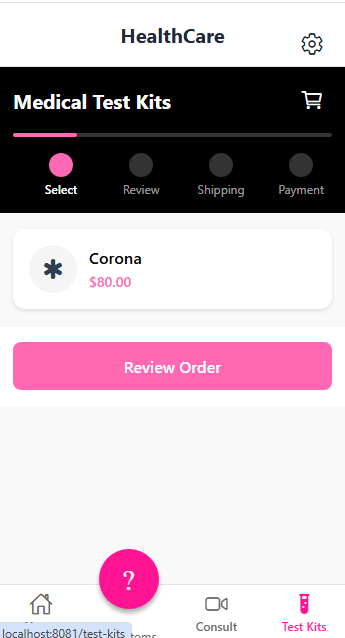
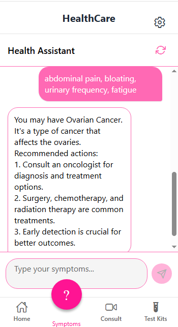
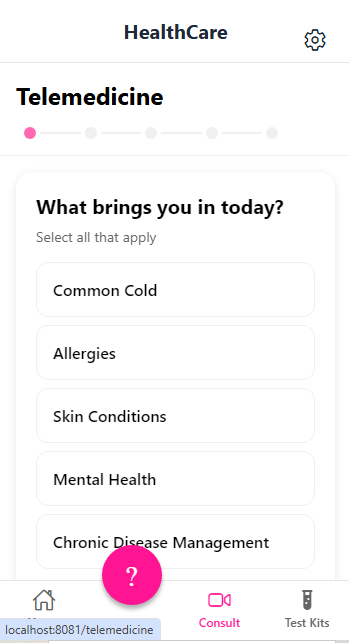

# HealthCarePlus App 🏥

A machine learning-based symptom checker application that helps identify potential medical conditions based on reported symptoms.


## Features

- **AI-Powered Symptom Checking**: Analyze symptoms to identify potential medical conditions
- **User-Friendly Interface**: Simple conversation-based symptom input
- **High Accuracy**: Machine learning model trained on extensive medical data
- **Instant Results**: Get potential conditions and precautions immediately
- **Privacy-Focused**: All data processing happens locally

## App Screenshots

<p align="center">
  
  
  
  
</p>

## Project Structure

```
healthcareplus-app/
│
├── app.js                  # Expo app entry point
├── data/
│   └── symptom_intents.json  # Symptom data for training
├── models/
│   └── symptom_checker.py    # Symptom checker model class
├── api/
│   └── app.py               # Flask API application
├── demo-images/             # Demo screenshots
│   ├── img1.png
│   ├── img2.png
│   ├── img3.png
│   └── img4.png
└── README.md               # This documentation file
```

## Getting Started

### Prerequisites

Make sure you have the following installed:
- Node.js (LTS version recommended)
- npm (Node Package Manager)
- Python 3.7 or higher (for the backend API)
- Expo CLI

### Installation

1. Clone this repository
   ```bash
   git clone https://github.com/yourusername/healthcareplus-app.git
   cd healthcareplus-app
   ```

2. Install frontend dependencies
   ```bash
   npm install
   ```

3. Install backend requirements
   ```bash
   pip install flask scikit-learn pandas numpy spacy
   python -m spacy download en_core_web_sm
   ```

### Running the App

1. Train the symptom checker model (if not already trained)
   ```bash
   cd api
   python train_model.py
   ```

2. Start the backend API
   ```bash
   cd api
   python app.py
   ```

3. Start the Expo app
   ```bash
   npx expo start
   ```

In the output, you'll find options to open the app in a:
- Development build
- Android emulator
- iOS simulator
- Expo Go

## API Endpoints

The symptom checker exposes the following REST API endpoints:

### Start a Session

```
POST /api/start_session
```

Returns a session ID to use for the conversation.

**Response:**
```json
{
  "status": "success",
  "session_id": "session_20251203120000_1234",
  "message": "Welcome to the symptom checker. Please describe your symptoms."
}
```

### Chat

```
POST /api/chat
```

**Request body:**
```json
{
  "session_id": "session_20251203120000_1234",
  "message": "I have continuous sneezing and watering from eyes"
}
```

**Response:**
```json
{
  "status": "success",
  "condition": "Allergy",
  "confidence": 0.85,
  "symptoms": ["continuous sneezing", "watering from eyes"],
  "matched_symptoms": ["continuous sneezing", "watering from eyes"],
  "response": "You may have Allergy. Allergy is a hypersensitivity disorder...",
  "precaution": "To avoid allergy:<br>1. Identify and avoid allergens..."
}
```

### End Session

```
POST /api/end_session
```

**Request body:**
```json
{
  "session_id": "session_20251203120000_1234"
}
```

**Response:**
```json
{
  "status": "success",
  "message": "Your symptom check session has ended...",
  "condition": "Allergy"
}
```

### Check Symptoms (Without Session)

```
POST /api/check_symptoms
```

**Request body:**
```json
{
  "symptoms": "continuous sneezing, watering from eyes"
}
```

**Response:** Same as the /api/chat endpoint.

### Health Check

```
GET /api/health
```

**Response:**
```json
{
  "status": "success",
  "message": "Symptom checker API is running"
}
```

## Technologies Used

- **Frontend**: React Native, Expo
- **Backend**: Flask, Python
- **Machine Learning**: scikit-learn, spaCy
- **Data Processing**: NumPy, Pandas

## Contributing

Contributions are welcome! Please feel free to submit a Pull Request.

1. Fork the repository
2. Create your feature branch (`git checkout -b feature/amazing-feature`)
3. Commit your changes (`git commit -m 'Add some amazing feature'`)
4. Push to the branch (`git push origin feature/amazing-feature`)
5. Open a Pull Request

## Disclaimer

This symptom checker is for informational purposes only and not intended to replace professional medical advice, diagnosis, or treatment. Always seek the advice of your physician or other qualified health provider with any questions you may have regarding a medical condition.